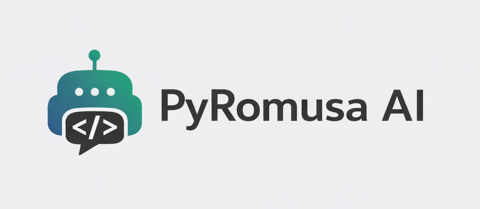

<h1 style="text-align: center;"><b>PyRomusa AI 🤖</b></h1>

**Have you ever imagined training your own chatbot that doesn't even have any existing vocabulary, 100% with your own examples type question-answer, without requiring very good hardware?** Well, `PyRomusa AI` will give you this possibility!

**`PyRomusa AI`** is a lightweight Python framework for creating simple AI chatbots with minimal code.




---
## Quick Navigation 🌐

This `📄README.md` file seems a bit long, right? 

Well, just click on the section (the blue text) below that interests you and you'll be taken directly there! 👇

- [Complete Code Example Using `PyRomusa AI`](#complete-code-example-using-pyromusa_ai)
    - Do you want to see what code using the `PyRomusa AI` library would look like or do you want some ready-to-copy-paste code to see how it works? Well, this is the section you should come to.

- [Why should I use `PyRomusa AI`? 🤔](#why-should-i-use-pyromusa-ai-)
    - Do you want a reason to use `PyRomusa AI` or still don't understand what `PyRomusa AI` is? You could find this information right here

- [`RealChatbot()` vs `Chatbot()`](#realchatbot-vs-chatbot)
    - You may have noticed: as of v0.9.0, there are now 2 types of chatbots in `PyRomusa AI`. Go to this section to find out which one suits you best based on your needs.

- [How to download `PyRomusa AI` directly from GitHub?](#how-to-download-pyromusa-ai-directly-from-github)
    - Are you ready to install PyRomusa AI directly from GitHub, on your hardware, and use PyRomusa AI? Here's a tutorial on how to install it from scratch.

- [Key Features 🔑](#key-features-) 
    - Are you new and still don't know what you can do and what capabilities `PyRomusa AI` has? Discover what you can do with this and what capabilities `PyRomusa AI` has.

- [Repository Structure 📁](#repository-structure-)
    - Are you new at this repository? Learn a little about the structure of this repository to find what you need.

- [Version Types Explained](#version-types-explained)
    -  Here you will find several versions of `PyRomusa AI`, each placed in a specific category, depending on how stable it is, how much effort has been put into fixing bugs, and what the respective version was released for.

- [About Prepared Datasets 🗄️](#about-prepared-datasets-️)
    - Did you know that you can use ready-to-use training datasets to save time creating input-output examples of a chatbot from scratch? Find here all available datasets, their specifications, and a complete example script with loading a dataset.

- [About Reply Engines](#about-reply-engines)
    - Does your chatbot seem to not understand the prompt you wrote or is writing extremely unclearly? This can probably be solved by changing the engine. Click here if you want to learn more about these engines.

- [Contact me 📩🌐](#contact-me-)
    - Do you want to talk to the person that created this library called `PyRomusa AI`? Here you will find all the available possibilities to contact me!

- [More ➕](#more-) 
    - Still haven't found what you need? You'll probably find it here.

- [Credits ⭐](#credits-)
    - Curious about what libraries and frameworks were used to create PyRomusa AI? Here you will find the answer + the main purpose of each
    
- [Notes](#notes)
    - There are some small things you should consider. Come here if you want to know these important things

---

## Complete Code Example Using `PyRomusa AI`

```python
"""
This code works correctly with the following versions:
BETA - v0.0.2
STABLE - v0.1.0, v0.1.1, v0.2.0, v0.3.0, v0.4.0, v0.4.1, v0.4.2, v0.4.3, v0.5.0, v0.6.0, v0.6.1, v0.6.2, v0.7.0, v0.7.1, v0.8.0, v0.9.0
EXPERIMENTAL - v001, v002, v003
"""

from PyRomusa_AI import Chatbot

# Create a chatbot named "RomusaBot"
bot = Chatbot(chatbot_name="RomusaBot")

# Add some input/output training data
bot.trainer.add_data(
    "Hello chatbot!",
    "Hello human, how can I help you today?"
)

bot.trainer.add_data(
    "Bye chatbot!",
    "Bye human, see you next time!"
)

# Start the training process
bot.trainer.start()

# Generate a response to a user input
print(bot.reply_at("Hello chatbot!"))
```

---

<h3 style="text-align: center"><b>In reality, this is how the code above works:</b></h3>

](images/how-the-code-works-video.gif)

<br>

---
## Why should I use `PyRomusa AI`? 🤔
### 1. Framework with a single goal: **creating chatbots from scratch**
- It is a framework optimized only for creating chatbots from scratch, with your own input-output training examples.
- It has functions specifically for creating a chatbot, without unnecessary functions

### 2. It is a small and new python framework
- Not much is known about this framework yet, and since it is a young framework, it receives regular updates. Any feedback and suggestions [sent via email or TikTok](#contact-me-) are welcome!

### 3. A fast framework
- The response generation time + training time in a single code run are generally much shorter than other major frameworks (`Chatbot()` object).

- **Want to see the real speed of the framework? Try the `🐍 benchmark.py` script**: It creates an instance of a chatbot (`Chatbot()` object), loads all available datasets, starts training, and responds to 10 prompts using the `modern` reply engine (works on PyRomusa AI STABLE v0.4.1 or newer).

### 4. A framework a little... different from others
- **`PyRomusa AI` comes with some more special concepts**: _[Reply Engines](#about-reply-engines) and [Prepared Datasets](#about-prepared-datasets-️)_
- It does not use some concepts from traditional AI, such as loss functions or hidden layers (`Chatbot()` object)

### 5. Focused on being easy to learn and use
- The syntax of this framework has been made as easy and logical as possible.
- Even though [the learning resources for this framework](#1-what-methods-do-i-have-to-learn-to-use-pyromusa-ai), available in February 2026, are not very advanced and detailed, at least they are diversified directly by the creator.
---
## `RealChatbot()` vs `Chatbot()`

### Some details about `RealChatbot()` object
Starting with version v0.9.0, you can train your own real pretrained LLM on your custom Q&A examples. To do this, there is the `RealChatbot()` object:

``` python
from PyRomusa_AI import RealChatbot

bot = RealChatbot()
```

This new object in `PyRomusa AI v0.9.0` is mainly based on `PyTorch` technologies and was focused on being able to be used exactly like the old `Chatbot()` object: both have the functions, for example, `bot.reply_at()`, `bot.trainer.add_data()`, `bot.trainer.start()`

---

### But why was `RealChatbot()` created, in principle?
There are probably `PyRomusa AI` users who expected something more: real LLM technologies

At the birth of the framework, the main goal was to create chatbots with the simplest syntax and without the need for advanced hardware, so the first object of `PyRomusa AI` was `Chatbot()`. It is based from the beginning on its own logic for generating responses and without the need for heavy hardware dependencies.

Those who have ever used the `Chatbot()` object have probably noticed a drawback: too frequent fallback messages and a lack of generalized messages compared to what was seen in the training datasets.

And how did he think we could get rid of its disadvantages (or not)? The answer is simple: by adding the `RealChatbot()` object based on real AI.

---
### Differences between `Chatbot()` and `RealChatbot()`
|object|advantages 📈|similarity ⚖️|disadvantajes 📉|
|:--|:-|:-:|-:|
|`RealChatbot()`|It has a much better generalization capacity than `Chatbot()`, could respond to more prompts, and has options to modify the architecture, depending on needs (`d_model`, `num_layers`, `num_heads`, `batch_size`, etc.)|It is a type of chatbot and has many main functions written exactly like the other objects.|Training can take anywhere from a few seconds/minutes to a few hours/days/weeks, depending on your configurations. It is also not optimized to generate a 100% correct answer based on just a few dozen training examples _(it needs thousands of examples or more to speak DECENTLY)_|
|`Chatbot()`|It is focused on running fast, can generate a correct spelling response if it finds the prompt in its training (even in dozens of training examples) and is very light on hardware compared to `RealChatbot()`. It is also based on the concept of Reply Engines: you can choose from several response generation strategies depending on your needs|It is a type of chatbot and has many main functions written exactly like the other objects.|It is more fragile if it doesn't have certain words in its training examples (it returns a fallback message) and can't generalize well. It also doesn't learn grammar/spelling rules like an LLM would, just word matching against what it saw.|

---
## How to download `PyRomusa AI` directly from GitHub?

### **This can be done by 3 methods:**

---
### **a) The clasic method**

1. Open a terminal on Windows, macOS, or Linux, open your command line (`Win + R`, then write `cmd` and press `Enter`) or terminal.

2. Install `PyRomusa AI` directly from `PyPI`, writing this in your terminal:
``` bash
pip install pyromusa-ai
```
**3. Test the installation**

Try to run this code:
``` python
from pyromusa_ai import Chatbot

bot = Chatbot()

bot.prepared_datasets.romanian.load_prepared_dataset("low")
bot.trainer.show_number_of_examples()
```
>If no errors appear, PyRomusa AI is installed and ready to use.

---

### **b) The GitHub method**

1. Make sure you have Python and pip installed (`PyRomusa AI` works with Python 3.8+).
2. Open a terminal on Windows, macOS, or Linux, open your command line or terminal.
3. Install `PyRomusa AI` directly from GitHub, writing this in your terminal:
``` bash
pip install git+https://github.com/Robertinoos13/PyRomusa-AI-Library.git#subdirectory=src
```
> This command tells pip to clone the repository and install the package automatically. You don’t need to download anything manually.

**4. Test the installation**

Try to run this code:
``` python
from pyromusa_ai import Chatbot

bot = Chatbot()

bot.prepared_datasets.romanian.load_prepared_dataset("low")
bot.trainer.show_number_of_examples()
```
>If no errors appear, PyRomusa AI is installed and ready to use.

---

### **c) The manual method**
Did you know that to install older versions of PyRomusa AI, the most stable installation method is this? **If you want to install older versions, then trust this method.**

1. Go to one of these folders: `📁 all versions/` or `📁 pyromusa-ai`
2. If you chose to go to folder `📁 all versions/`, then select a version type, the exact version, and look for file `🐍PyRomusa_AI.py`. If you went the other way, look for the `🐍core.py` file.
3. Once you've found one of the Python files, install it or copy all of its contents to a Python file you created on your hardware.

    > By the way, if you made it to step 3, make sure the Python file I told you about is in the same folder as the python file where you will use the `PyRomusa AI` functionalities. We will talk more about this in step 4.

4. In order to use `PyRomusa AI` in your code, the 2 Python files must be in the same folder, with a structure something like this:
    ```
    |- 📁Your Folder/
    |----- 🐍PyRomusa_AI.py
    |----- 🐍you_code.py
    |----- 📁Datasets/
    |--------- 🐍other python files
    |----- 📁Reply_Engines/
    |--------- 🐍other python files
    ```

    Where:
    |Name|Description|
    |:--:|:----------|
    |`📁Your Folder/`|The folder where your Python code should be located where you want to use `PyRomusa AI` + the main framework code|
    |`🐍PyRomusa_AI.py`|The main code of the `PyRomusa AI` framework|
    |`🐍you_code.py`|Your code, where you will use `PyRomusa AI`|
    |`📁Datasets/`|This is a folder with several optional Python files that `🐍PyRomusa_AI.py` needs to function fully.|
    |`📁Reply_Engines/`|The folder and its contents, from v0.7.0, are very important for generating responses based on prompts. This is a required folder.|

    > Did you know that `PyRomusa AI` uses several optional Python files that it needs to function fully and error-free? Well, they are found in the repository in a folder called `Datasets/`

---
## Key Features 🔑
- Create a chatbot in just a few lines of Python  
- Simple training process (no heavy frameworks involved on `Chatbot()` object)  
- Multiple version types: Stable, Beta, and Experimental  
- Beginner-friendly and easy to understand  
- No high-end GPU required (`Chatbot()` object)

---

## Repository Structure 📁
All versions of `PyRomusa AI` from all time are stored inside the `📁 all versions/` folder.

```
|-📁 all versions/
|
|----📁 BETA versions/ 
|--------📁 PyRomusa_AI - v0.0.X
|
|----📁 EXPERIMENTAL versions/
|--------📁 PyRomusa_AI - vXYZ
|
|----📁 STABLE versions/ 
|--------📁 PyRomusa_AI - v0.X.Y
```


Each version folder contains:
- A full `🐍PyRomusa_AI.py` file 
- A dedicated `📄README.md` for that version  

---
`📁 src` - This is the newest stable version of `PyRomusa AI`. Its structure is optimized so that you can install it with `pip install` from your terminal. [Click on this text to learn how](#a-the-clasic-method)

`📁 tutorials/` - This is a folder where all sorts of tutorials will be written to use the library.

`📁 important updates/` - This folder will provide a more detailed description of all the important updates that `PyRomusa AI` has had so far.

`📁 images/` - In this folder you will find all the images that the repository usually uses in this README.md file.

`🐍 benchmark.py` - A stress-free, ready-made script that uses `PyRomusa AI` to test the runtime on your hardware.

`📁 .github` - Less important files related to COMMUNITY STANDARDS are placed here. You will find files like `📄CONTRIBUTING.md`, `📄SECURITY.md`, etc.

---

## Version Types Explained
As this repository has various versions of `PyRomusa AI` that are older, newer, or more buggy, they have been grouped into 3 categories, placed in the `📁 all versions/` folder:

### BETA 🤖🛠️
- Still in development  
- May contain bugs, incomplete features, or small issues  

### STABLE 😁👍
- Recommended for normal usage  
- Fully functional, tested, and considered complete  

### EXPERIMENTAL 🧪🔬
- Radical changes and experimental ideas  
- Not intended for production use  

---

## About **Prepared Datasets** 🗄️

Did you know that from `PyRomusa AI` you can load a ready-made training dataset to the model? Well, here's an example below:
``` python
from PyRomusa_AI import Chatbot

# 1. Create your chatbot
bot = Chatbot(chatbot_name="MyChatbot")

# 2. Load a prepared dataset (in this example, you load the smallest default dataset in Romanian)
bot.prepared_datasets.romanian.load_prepared_dataset(dataset_name="low")

# 3. Start training
bot.trainer.start()

# 4. Enjoy to use the chatbot (Salut! = Hello!)
print(bot.reply_at(prompt="Salut!"))

```

---

<br>

<h3 style="text-align: center">Info of All Prepared Datasets Available</h3>

|Dataset Name|Vocabulary|Number of examples|Word to acces it|Language|Naturalness|Focus on same questions|Focus on diversifying output|Planned to be updated|Avaiable in|
|---|:---:|:---:|:---:|:---:|:---:|:---:|:---:|:---:|:---:|
|**Default Romanian Dataset: LOW-END**|3625|250|'low'|Romanian|Critically Low|No Effort|No Effort|NO ❌|**BETA v0.0.1** or newer|
|**Default Romanian Dataset: MID-RANGE**|8242|500|'mid'|Romanian|Critically Low|No Effort|No Effort|NO ❌|**BETA v0.0.1** or newer|
|**Default Romanian Dataset: HIGH-END**|11581|1000|'high'|Romanian|Critically Low|No Effort|No Effort|NO ❌|**BETA v0.0.1** or newer|
|**High Quality, Very Low Quantity Romanian Dataset**|496|50|'high-quality-very-low-quantity'|Romanian|Very High|Very Low|No Effort|NO ❌|**STABLE v0.1.1** or newer|
|**High Quality, Low Quantity Romanian Dataset**|874|100|'high-quality-low-quantity'|Romanian|High|Very Low|No Effort|NO ❌|**EXPERIMENTAL v001** or newer|
|**Teacher for PyRomusa AI**|_397_ - _1078_|_110_ - _360_|'pyromusa-ai-teacher'|Romanian|Very High|High|No Effort|YES 👍|**STABLE v0.2.0** or newer|
|**Default English Dataset: LOW-END**|949|250|'low'|English|No Effort|Balanced|No Effort|NO ❌|**STABLE v0.4.1** or newer|
|**Default English Dataset: MID-RANGE**|1713|500|'mid'|English|No Effort|Balanced|No Effort|NO ❌|**STABLE v0.4.1** or newer|
|**Default English Dataset: HIGH-END**|3100|1000|'high'|English|No Effort|Balanced|No Effort|NO ❌|**STABLE v0.4.1** or newer|

_(Some values ​​in the `"Vocabulary"` and `"Number of examples"` columns may be approximate.)_

<br>

<h4 style="text-align: center">Explanation for Each Column:<h4>

|Column Name|Description|Possible Values (from worst to best)|
|:---:|:---|:---:|
|_Dataset Name_|**The dataset name will be written here so that each dataset is unique.**|-|
|_Vocabulary_|**This is where you will write the total number of different words in the dataset.** It is important for the chatbot to have a diverse vocabulary from different domains to talk about more things.|1 to infinite <br> (higher = better)|
|_Number of examples_|**This is where you will put the total number of input-output examples that the dataset has.** It is important to have a high number, because it is said that this way you have a better chance of answering more prompts correctly (theoretically speaking...).|1 to infinite <br> (higher = better)|
|_Word to acces it_|**Here we will put a recommended option to access the dataset in the `bot.prepared_datasets. ... ` function, putting it in `dataset_name` variable.** It is important to know how to access a specific dataset in your code.|-|
|_Language_|**This will be the language that most of the dataset examples are in**. It's important to understand what the chatbot is saying.|-|
|_Naturalness_|**This represents who the input/output examples  are made by and how (how much HUMAN vs AI). Better = more HUMAN**|**No Effort, Critically Low, Very Low, Low, Balanced, High, Very High**|
| _Focus on same questions_|**Here you will find out how much focus was placed on the chatbot that has this dataset to recognize the same question, but written in a different form by the user.** It is important to know how much patience you need to have for the chatbot to understand what you are saying, so that it does not fallback or write something difficult to understand.|**No Effort, Critically Low, Very Low, Low, Balanced, High, Very High**|
|_Focus on diversifying output_|**Here you will find how diverse the outputs are for the same user input in the training examples of the respective dataset.** This is an important concept if you want the chatbot to not respond with the same message every time you type the exact same input (be sure to use the `temperature` parameter with a value greater than 0 for this to work)|**No Effort, Critically Low, Very Low, Low, Balanced, High, Very High**|
|_Planned to be updated_|This column shows whether the prepared dataset will be updated in the future. If YES, the dataset specifications vary depending on the version of `PyRomusa AI`.|**NO, MAYBE, YES**|
|_Avaiable In_|**Here you will find in which oldest version this dataset started appearing in.** It is important to know which version to look for in the `versions/` folder if you want to use a specific dataset.|OLDER VERSION <br>=<br> Greater compatibility & better|

---

## About **Reply Engines** 
**Did you know that you can change the logic in which the chatbot will generate a response?** Well, that's a new concept in the `STABLE 0.2.0` release!

**But why was this new concept added?** Well, it **was observed that with a changed logic for generating responses, the chatbot responds more chaotically, more stably, faster, or more precisely to a certain length of the prompt**, so that's how the concept of engines was born: _to optimize the goal of your chatbot._

### Engines available in the latest version of `PyRomusa AI`:

|Engine Name|Advantages|Disadvantages|
|:---------:|:---------|:------------|
|  `stable` |In general, it writes more correctly in terms of word order, and the chatbot's response is also much easier to read and understand.|High chances of not understanding an extremely short prompt (e.g. a word or two), even if it has it as an example in training, also returning a fairly easy fallback message.|
|  `chaos`  |Makes more of an effort to understand a message, so the chances of returning an automatic fallback message are lower.|In general, he writes some strange and quite difficult to understand messages, often not knowing what the chatbot meant. It can also write too many or too few words, thus compounding the difficulty of fully understanding what the chatbot meant.|
| `modern`  |It is the first engine based on NumPy. It doesn't matter if you write letters with diacritics or accents or not, the chatbot will still understand. It can now return a generated answer to a one-word prompt, without returning a fallback message, as we encounter, completely the opposite, in the `stable` engine.|In general, the response generation time is longer than in other available engines (`chaos`, `stable`).|
| `optimized`|It has the best speed/quality (x2 more speed than `modern`, similar quality) ratio in May 2026 of all Reply Engines available at this time. It can also generate slightly different responses than what is seen in the training examples.|The quality of the answers, in practice, is slightly worse than what `modern` can generate|
| `unsmarty` |Can replace a word from what is seen in the training examples|It generates a response 2x slower than `modern`, puts too much spacing between certain characters, and takes too much account of recent conversations|


### Short tutorial/code: **How to use an engine of your choice?**

---

_By the way_: This is a complete tutorial. **If you are only interested in how to select the engine when you want to generate a response, then skip to step 5.**

---
``` python
# 1. First, import the Chatbot from PyRomusa AI
from PyRomusa_AI import Chatbot


# 2. Create an instance of the chatbot
bot = Chatbot(chatbot_name="test")


# 3. Add training examples or upload a prepared dataset
# ---
bot.trainer.add_data(
                    training_input_example= "...",
                    training_output_example= "..."
                    )

# AND / OR...

bot.prepared_datasets.romanian.load_prepared_dataset(
                                                    dataset_name="..."
                                                    )
# ---

# 4. Start the training
bot.trainer.start()

# 5. Generate the answer... **choosing the engine you want**
print(bot.reply_at(
    prompt="Hey Chatbot!",
    engine_name="chaos" # Here you write the name of the desired engine
))
```


---
## Contact me 📩🌐

Do you want to give me a new idea for functionality for `PyRomusa AI`, have you detected a bug in a particular version, want to ask me something, give me feedback, need help, a tutorial from `📁tutorials/` is not cleary or just want to say hello? Anything friendly message and/or about `PyRomusa AI` is welcome!

- e-mail: pyromusa.ai@gmail.com

- TikTok: [@pyromusa_ai](https://www.tiktok.com/@pyromusa_ai?is_from_webapp=1&sender_device=pc)

---

## More ➕

### 1. What methods do I have to learn to use `PyRomusa AI`?

At the moment _(February 19, 2026)_, these PyRomusa AI learning options are quite limited, but you have the following methods:

1. Find random codes through this repository
    - In almost every README.md there is a piece of code where `PyRomusa AI` is used. Look at these and get inspired

2. Watch videos about `PyRomusa AI`, specifically on the TikTok account [@pyromusa_ai](https://www.tiktok.com/@pyromusa_ai?is_from_webapp=1&sender_device=pc)
    - Sometimes, videos are posted on this TikTok account just about `PyRomusa AI`: from updates and little jokes to code and tutorials. Scroll through the videos here and find what you want.

3. Look in the `📁 tutorials/` folder in this repository

    - This folder, at the moment, does not have a code tutorial, but only a few text guides to solve problems like 'Why can't I load a prepared dataset?' or 'How do I setup PyRomusa AI in my code?', but it is planned to include code tutorials here in the future.

4. Use the prepared dataset 'Teacher for PyRomusa AI'

    - Yes, you can load this prepared dataset for your chatbot in your code, and then ask it questions. This dataset has input-output examples, specifically designed to answer your questions about `PyRomusa AI`. Indeed, it can't answer every question because of the poor vocabulary specifications and the number of examples, but it can answer basic questions. (By the way, you need to know Romanian to use it)


5. Install `PyRomusa AI` & Run the code:
```python
from PyRomusa_AI import Chatbot

# Create a chatbot
bot = Chatbot()

# Get help
bot.helper.how_to_start()
```
---
## **Credits ⭐**

`PyRomusa AI` uses several other external Python libraries to function properly and completely. In this table below, you will find each external library used and its most important purpose in `PyRomusa AI`:

|Library name|Objective|Name/Link of the repo in GitHub|
|:---:|:---:|:---:|
|`numpy`|The logic behind the 'modern' reply engine|[numpy](https://github.com/numpy/numpy)|
|`pandas`|To create tables (dataframes) for some functions in `bot.helper. ...`|[pandas](https://github.com/pandas-dev/pandas)|
|`pyrospeak`|For talking chatbots (TTS transformation)|[PyroSpeak-Library](https://github.com/Robertinoos13/PyroSpeak-Library)|
|`pytorch`|For main technology of the `RealChatbot()` object|[pytorch](https://github.com/pytorch/pytorch)|

<br>

Thank you for creating these Python frameworks/libraries 🙏

---

## **Notes:** 
- Versions prior to `BETA 0.0.1` were initially released under the name `muri_ai`.
**The project has been renamed to `PyRomusa_AI` to avoid naming conflicts and for better branding.**

- Do you notice that the codes in this repository that use `PyRomusa AI`, you often find `from PyRomusa_AI import Chatbot`, and sometimes you also find `from pyromusa_ai import Chatbot`? **Well, know that if you install `PyRomusa AI` via `pip install ...`, in your code you will use `pyromusa_ai`, AND if you install it manually from the repository and do not change its name, then you will use `PyRomusa_AI`**

- **Some information in this repository may be incorrect or outdated.** Please manually verify the information you want before taking it 100% into account. If you do find incorrect or outdated information, please [contact me.](#contact-me-)

- To install an EXPERIMENTAL or BETA version, [the installation must be done manually](#b-the-manual-method), it is not possible with `pip install`

- In the Python code examples in `📄README.md` files, **you see the word `bot`** quite often, right? Well, **that's the instance of the chatbot class (`bot = Chatbot()`)**

---

<br>

Did you find the functionalities interesting, did it help you a lot in a project of yours, or do you think `PyRomusa AI` has potential? Then leave a ⭐ so I know this information, so I know what you think about `PyRomusa AI` at the moment.